# Solutions

## INFORMATION DISCLOSURE

First challenge in the list is “Information Disclosure”. From the following image you can see that API end point is &lt;host&gt;/api/v1/books/&lt;ISBN&gt;/ and use valid ids mentioned .

<kbd>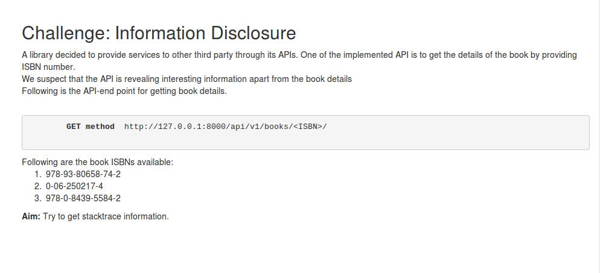</kbd>

Start your RESTClient app, issue a HTTP GET request to the end point you will get the response from server as given below

<kbd>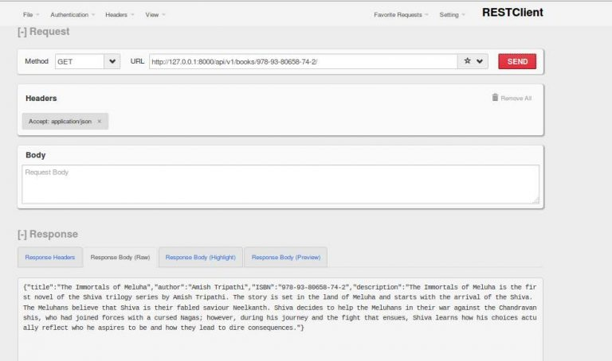</kbd>

Now for getting stack trace information try to manipulate the ISBN values, after trying different character sets you will get the stack information for the ISBN value containing Capital Alphabet.Following is the solution for information disclosure challenge.

<kbd>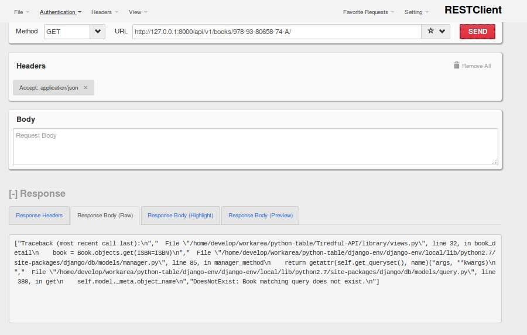</kbd>

## INSECURE DIRECT OBJECT REFERENCE
Now moving on to next challenge “Insecure Direct Object Reference”. From the following image you can see the API end point is &lt;host&gt;/api/v1/exams/&lt;exam_id&gt;/.

According to the challenge user “batman” has took exams with exam id are MQ==, Mg==.Lets try to access the API end point.

<kbd>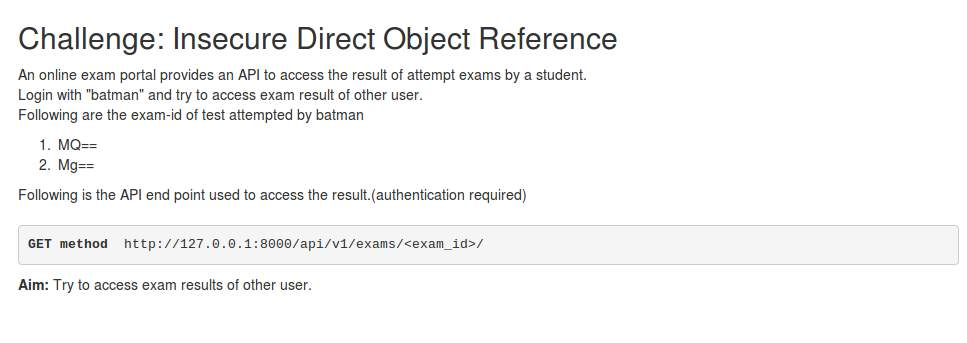</kbd>

On analyzing the exam ids we come to know that all these ids are base64 encoded. So to get the scorecard of another user we need to manipulate exam id and encode it in base64 form.

According to challenge description authentication is needed to access the scorecard, so in order to get access token navigate to user token link and obtain an access token for user “batman”.

<kbd>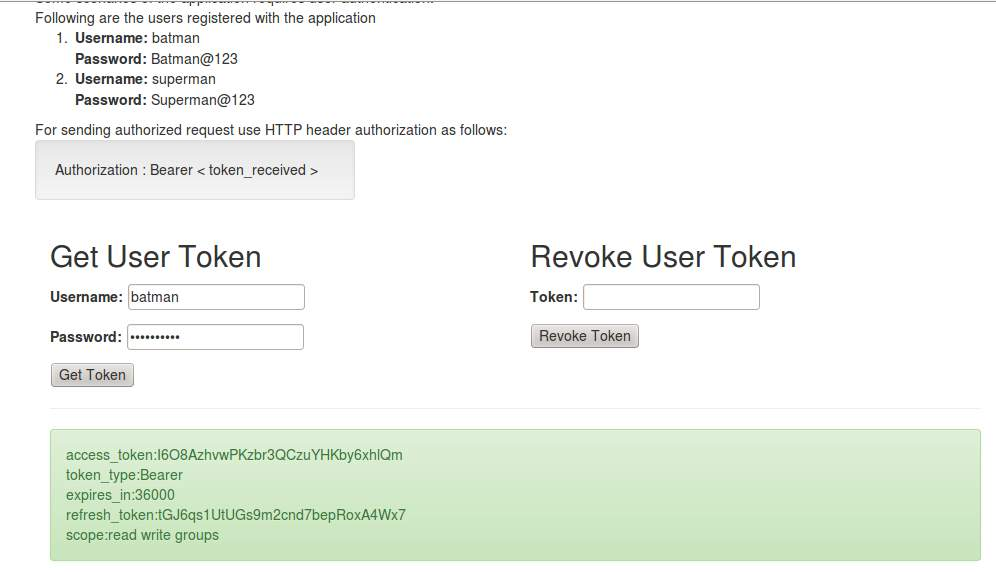</kbd>

Use obtained access token to consume API end point as shown in the image.

<kbd>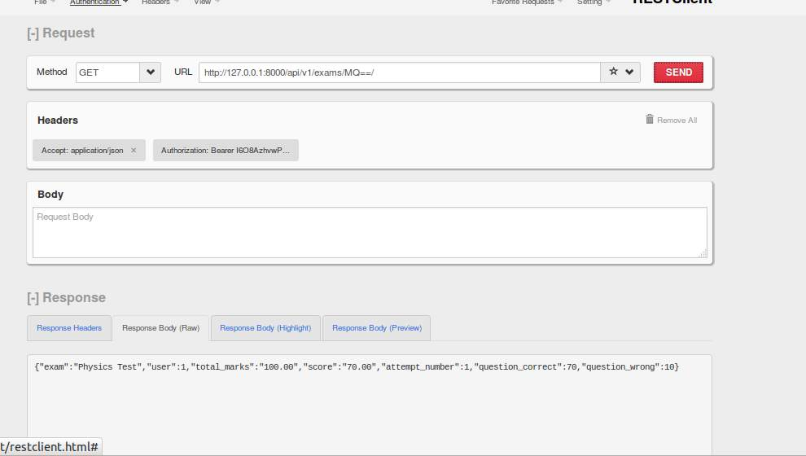</kbd>

Now try to access the another user’s scorecard, iterate over the exam-id parameter and don’t forget to use base64 encoding before issuing the GET request to API end point. You will get the scorecard of another user by using exam id 56(NTY=), 93(OTM=).

<kbd>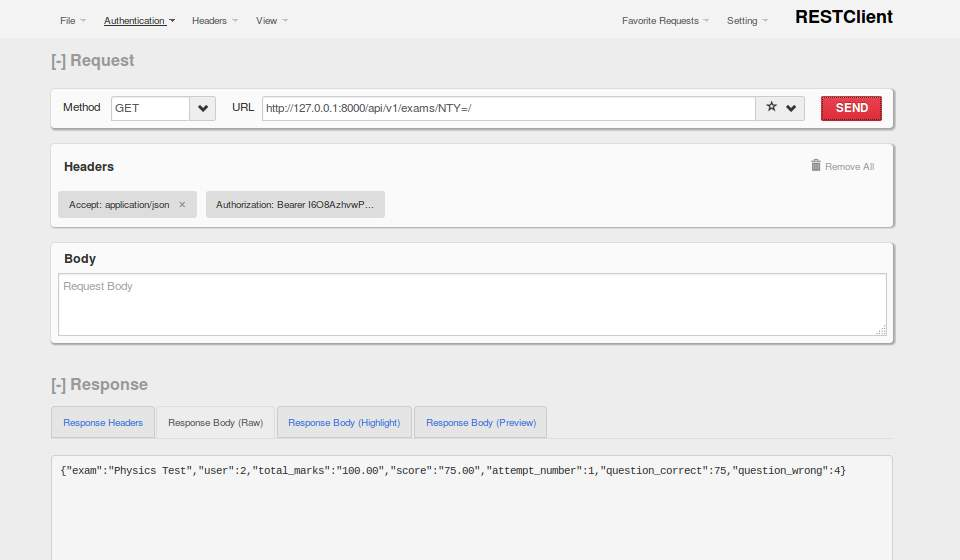</kbd>

## ACCESS CONTROL

According to challenge description, our aim is to execute an operation which should be allowed only to admin user.In this challenge to exploit access control flaw we will consume &lt;host&gt;/api/v1/articles/&lt;article-id&gt;/ end point.

<kbd>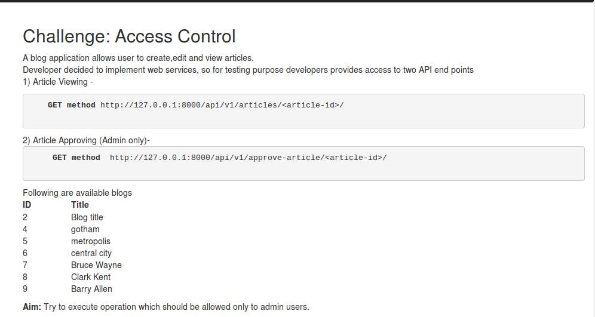</kbd>

So first try to access API end point in normal way and analyze the headers sent by the web server, you will find the API end point supports the DELETE HTTP method also.

<kbd>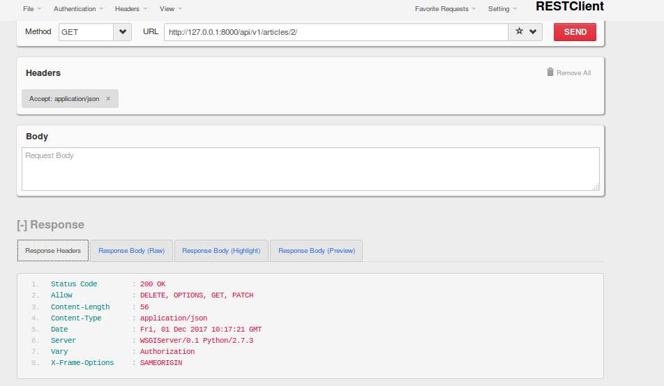</kbd>

Now try to issue a DELETE request to the API end point and analyze response from the application. In the response body you will see application responded with message “isAdmin” missing.

<kbd>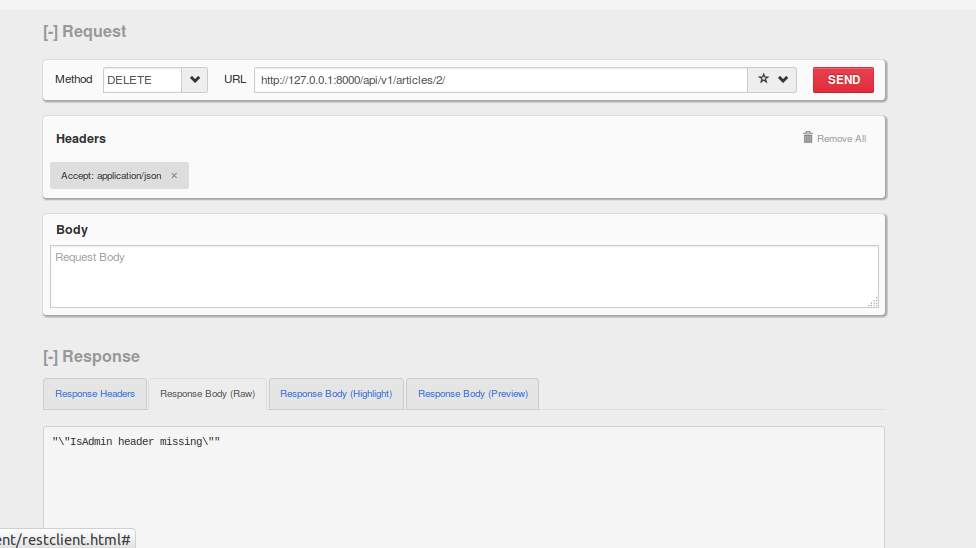</kbd>

Now by the name of non standard HTTP header, we can deduce that the header is accepting boolean value. Set the “isAdmin” header with “True” and issue a DELETE request and you will be able to delete a resource which should not be allowed to anonymous user.

<kbd>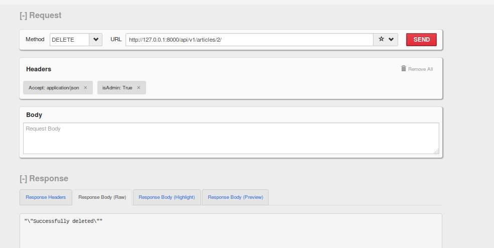</kbd>


## THROTTLING

The aim of this challenge is to force the server to respond with 429 response code (Too Many Requests). We need to use &lt;host&gt;/api/v1/trains/ API end point with Post body(Use Content-Type header with application/json value).

Solution of this challenge is straight forward.Issue 10 requests to the API end point with anonymous user (without Authorization header) and 20 requests with authenticated request(with Authorization header).

<kbd>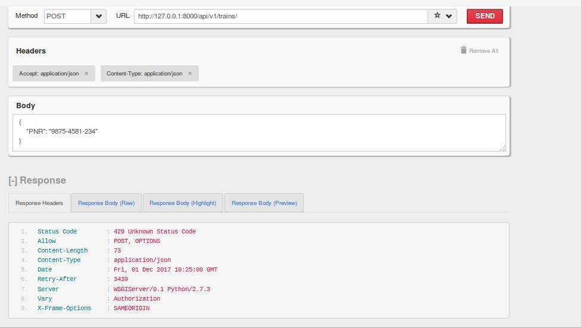</kbd>

Following is the throttling solution for authenticated user.

<kbd>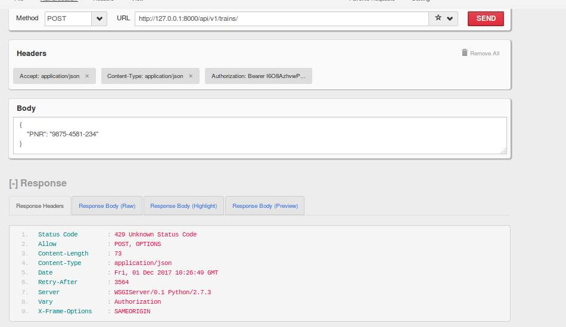</kbd>


## SQLITE INJECTION

The aim of this challenge is to figure out database table names using SQLite Injection, since the app is using SQLite backend the syntax and table names will differ from our conventional SQLi on MySQL servers.

<kbd>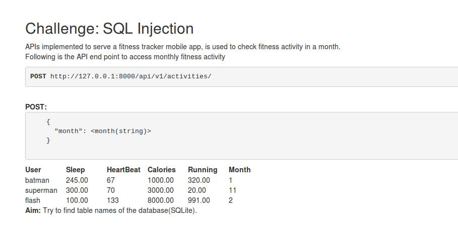</kbd>

First try to consume API end point in a normal way, we will be consuming &lt;host&gt;/api/v1/activities/ with POST body(Use Content-Type header with application/json value). The POST body will contain “month” parameter.

<kbd>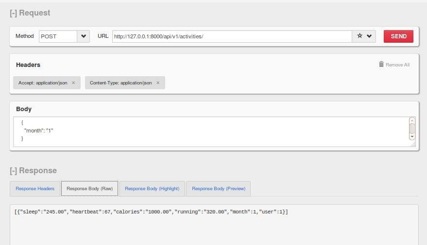</kbd>	

Application will respond with activities stat for POST request, analyze the response body and try to deduce number of columns used in query. The response body contains 6 name-value pairs which means column used in the embedded SQLite query is 6 or more than 6.

 

Now try to append SQLite query to the value of “month” parameter and observe the result you will get the table names in the response body.

Following is the payload used to extract table names from database.

```
{
"month": "1 UNION SELECT 1,2,3,4,5,6,name FROM sqlite_master WHERE type='table';"
}
```

<kbd>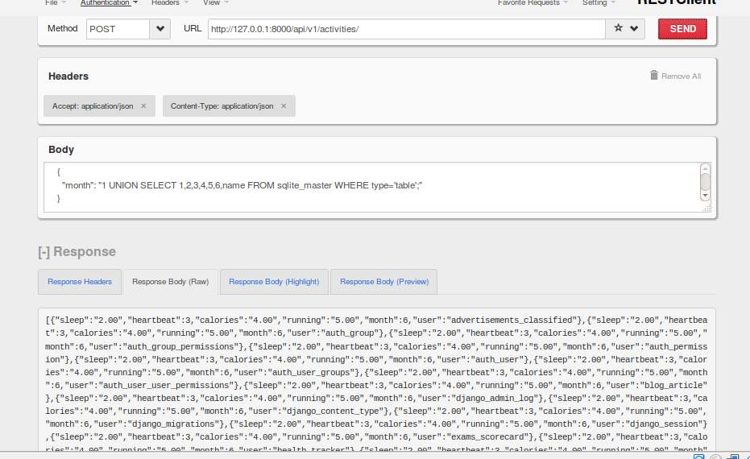</kbd>

## CROSS SITE SCRIPTING

Impact of the cross site scripting attack will depend on the client. Successful exploitation of cross site scripting flaw will be totally dependent on how client is processing data send by the server. The aim of this challenge is to find out which of the paramters mentioned in the POST body is accepting the cross site scripting meta characters.

According to challenge we need to use &lt;host&gt;/api/v1/advertisements/ API end point with GET method to retrieve list of classified posted and POST method (Use Content-Type header with application/json value) to create a new classified.

<kbd>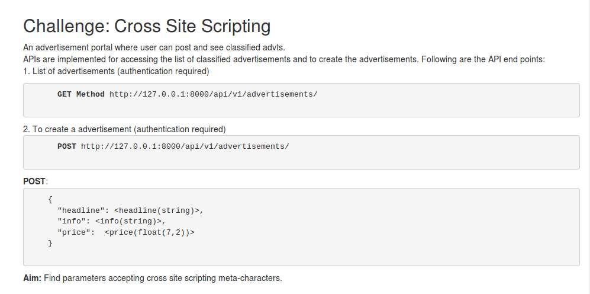</kbd>

Since the challenge needs an authenticated user, so first obtain an access token for any user from user token page.

<kbd></kbd>

Now first create an advertisement with valid set of input and observe which of the parameters are accepting string values.

<kbd>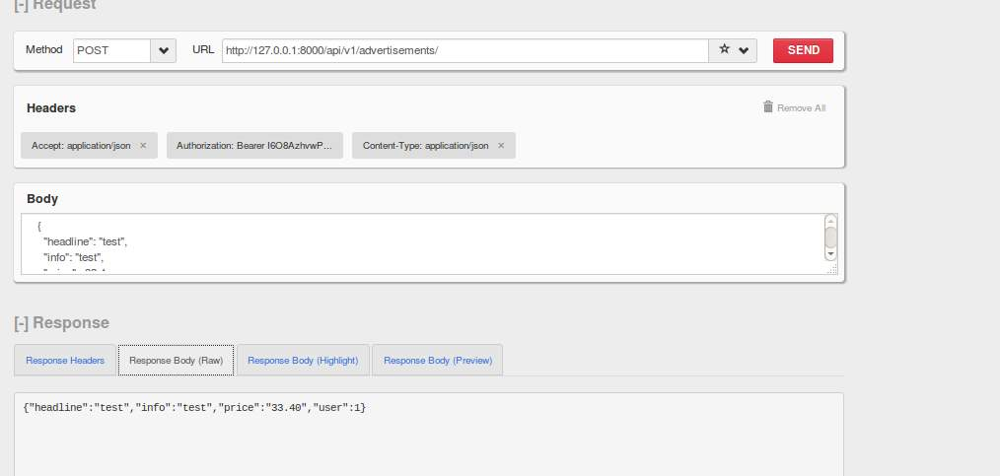</kbd>

Now provide "<script>alert('solution')</script>" as input to all the suspected parameters. In order to check if classified is created with cross site scripting meta characters, issue a GET request to the API end point and observe the result.

<kbd>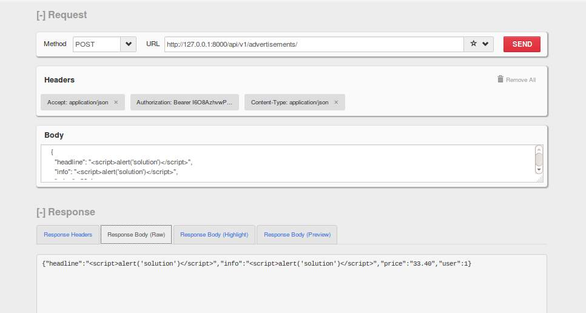</kbd>

Following is the image listing all the classified created.

<kbd></kbd>


## JWT INFORMATION DISCLOSURE

The aim of the challenge to check whether the JWT token contain any sensitive information which can be used by an attacker to perform some malicious activity.

<kbd>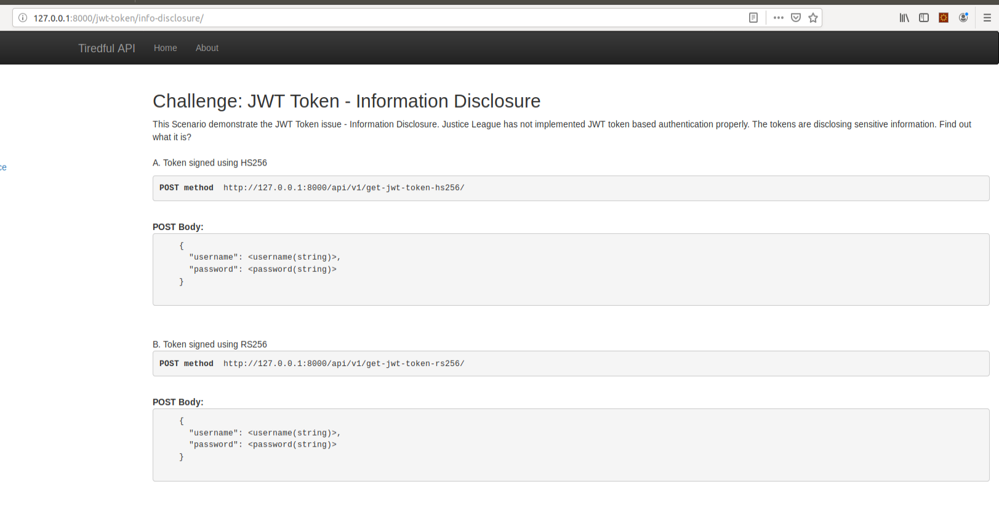</kbd>

According to the challenge we need to obtain JWT tokens from following API end points
1. &lt;host&gt;/api/v1/get-jwt-token-hs256/
2. &lt;host&gt;/api/v1/get-jwt-token-rs256/

Obtain a HS256 signed JWT token from the API end point &lt;host&gt;/api/v1/get-jwt-token-hs256/ using any user.
<kbd>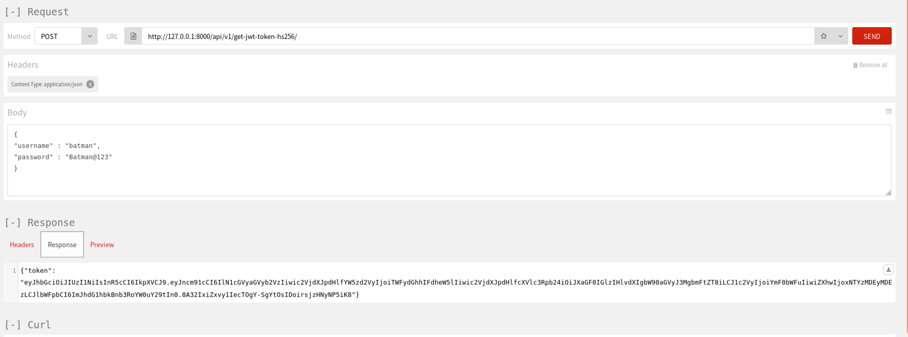</kbd>

Now navigate to [https://jwt.io/](https://jwt.io/) and paste the obtained JWT token and analyze the "payload" section you will find the "Security Question" and "Security Answer" values of the user account.

<kbd>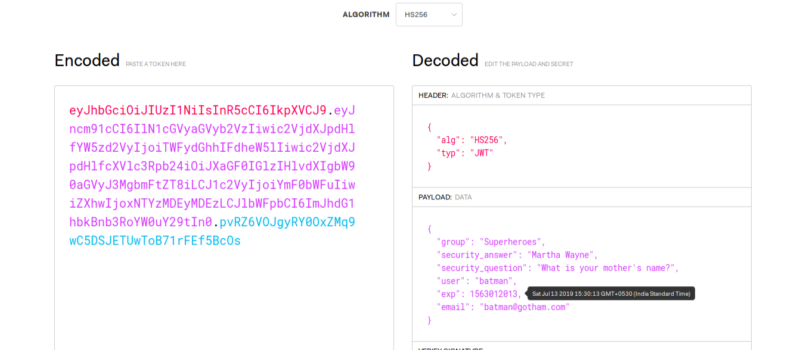</kbd>

Now for RS256 signed token, obtain JWT token from the API end point &lt;host&gt;/api/v1/get-jwt-token-rs256/
<kbd>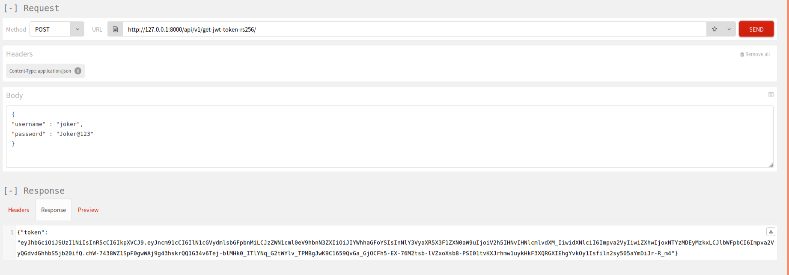</kbd>

Now navigate to [https://jwt.io/](https://jwt.io/) and paste the obtained JWT token and analyze the "payload" section you will find the "Security Question" and "Security Answer" values of the user account.

<kbd>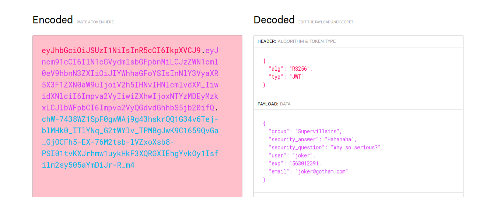</kbd>


## JWT None Signing Algorithm

The aim of the challenge is to find out Joker's devious plan using Batman's or any other superheroes account available. Superheroes need to forge token using "none" signing algorithm to figure out the Joker's plan.

<kbd>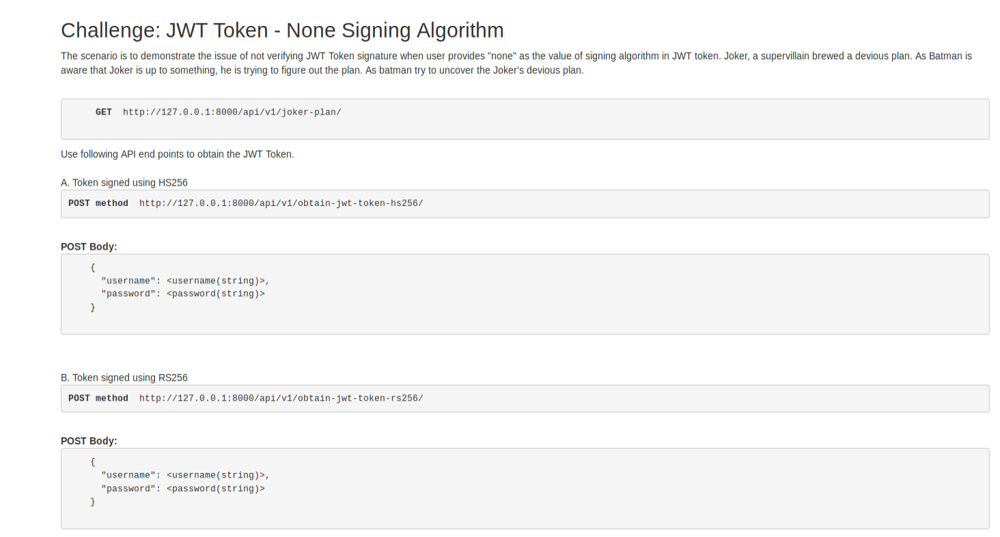</kbd>

According to the challenge we need to obtain JWT tokens from following API end points
1. &lt;host&gt;/api/v1/obtain-jwt-token-hs256/
2. &lt;host&gt;/api/v1/obtain-jwt-token-rs256/

Obtain a HS256 signed JWT token from the API end point &lt;host&gt;/api/v1/obtain-jwt-token-hs256/ using any Superhero

<kbd>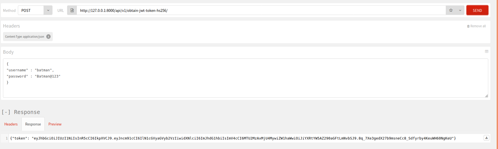</kbd>

Try to access the API end point &lt;host&gt;/api/v1/joker-plan/ with obtained token, it will give permission denied error.

<kbd>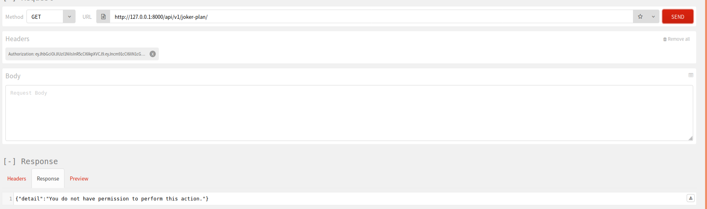</kbd>

Similarly you can obtain a RS256 signed token from the API end point &lt;host&gt;/api/v1/get-jwt-token-rs256/ using any Superhero

<kbd>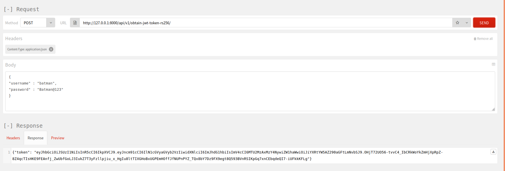</kbd>

Try to access the API end point &lt;host&gt;/api/v1/joker-plan/ with obtained token, it will give permission denied error.

<kbd>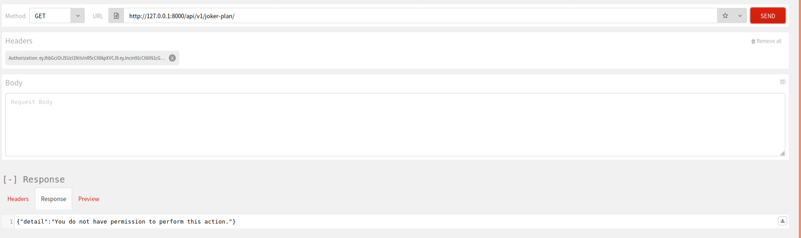</kbd>


Now if you decode any of the obtained token using [https://jwt.io/](https://jwt.io/) and analyze the "payload" part you will find an element - "group".

For HS256 signed token

<kbd>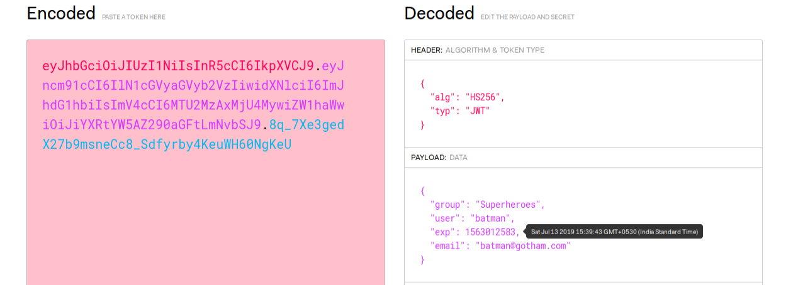</kbd>

For RS256 signed token

<kbd>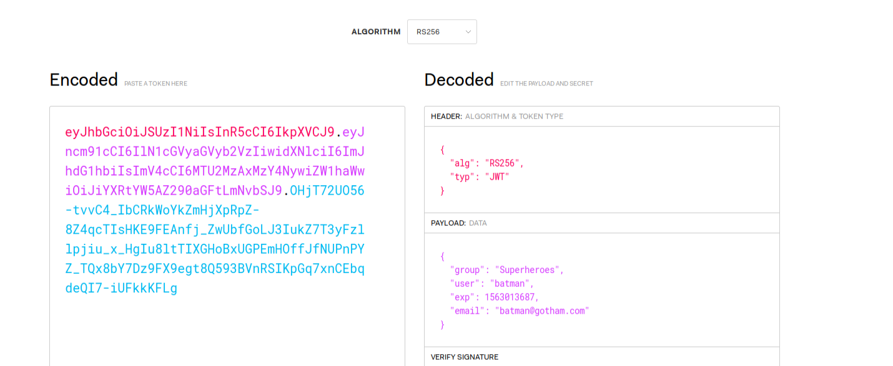</kbd>


Change "group" element value from "Superheroes" to "Supervillains" and create a token using "none" as value of "alg" element in the JWT header. After making all the required changes encode separately the header and payload section of JWT using base 64 encoding scheme. Then concat all the parts leaving last part as blank i.e. &lt;base64 encoded header &gt;.&lt;base64 encoded payload &gt;.

<kbd>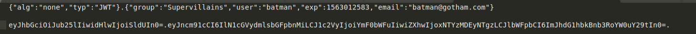</kbd>

Now use created token to access the Joker's plan from API end point &lt;host&gt;/api/v1/joker-plan/ and Voila! Check the response.

<kbd>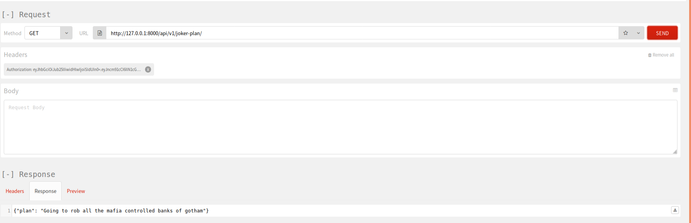</kbd>


## JWT Signing Algorithm

The aim of the challenge is to find out Joker's master devious plan from the API end point  &lt;host&gt;/api/v1/joker-master-plan/ using Batman's or any other superheroes account available but this time Joker implemented RS256 signing algorithm. Superheroes have access to public key used in RS256 implementation and they have to forge HS256 signed token and use public key as secret to sign the token.

<kbd>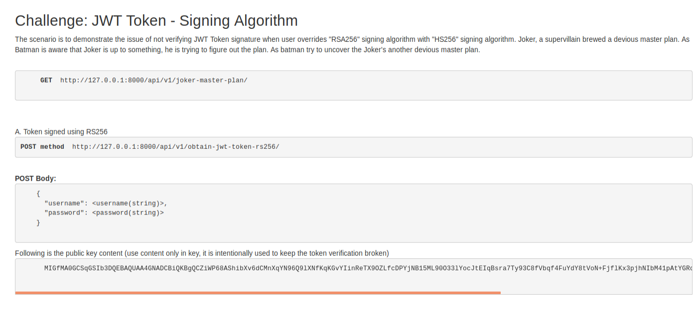</kbd>

According to the challenge we need to obtain JWT tokens from following API end point
1. &lt;host&gt;/api/v1/obtain-jwt-token-rs256/

Obtain RS256 signed JWT token from the API end point &lt;host&gt;/api/v1/obtain-jwt-token-rs256/.

<kbd>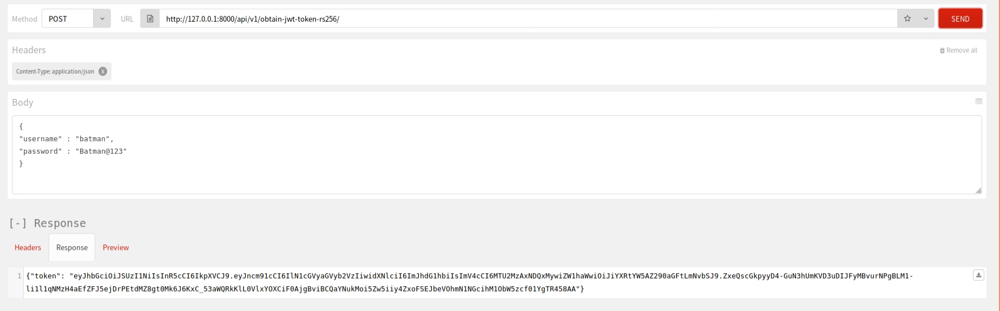</kbd>


Try to access the Joker's master plan using  &lt;host&gt;/api/v1/joker-master-plan/ API end point and it will say permission denied.

<kbd>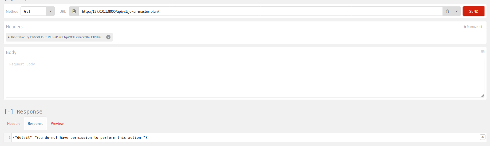</kbd>


Now if you decode the obtained token using [https://jwt.io/](https://jwt.io/) and analyze the "payload" part you will find an element - "group".

<kbd>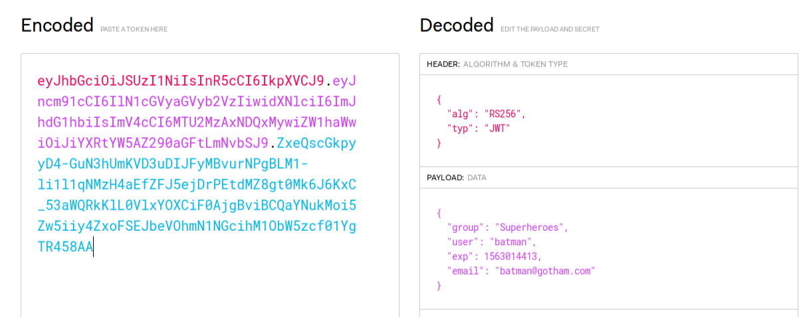</kbd>

Change "group" element value from "Superheroes" to "Supervillains" and create a token using "HS256" as value of "alg" element in the JWT header. After making all the required changes encode separately the header and payload section of JWT using base 64 encoding scheme. Then concat all the parts leaving last part as blank i.e. &lt;base64 encoded header &gt;.&lt;base64 encoded payload &gt&lt;signature computed using puclic key as secret &gt;

Following is the key used.

<kbd>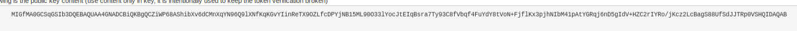</kbd>

JWT token created and signed using HS256 algorithm.

<kbd>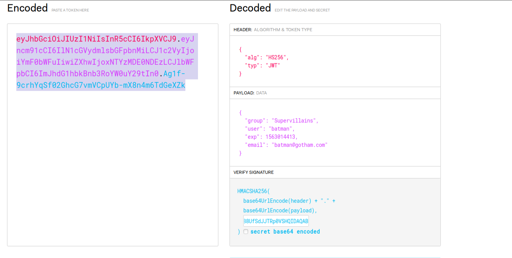</kbd>

Now use created token to access the Joker's master plan from API end point &lt;host&gt;/api/v1/joker-master-plan/ and Voila! Check the response.

<kbd>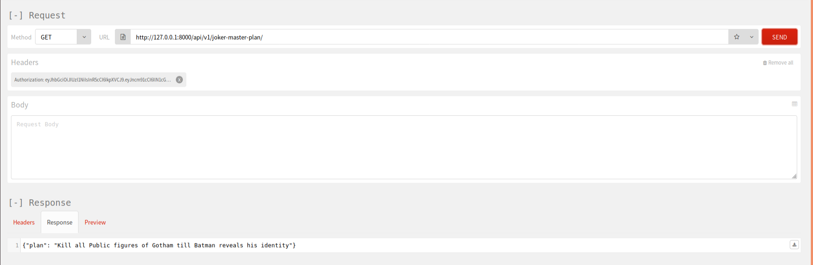</kbd>


## JWT Token Revocation

The aim of the challenge to show the correct/secure implementation of logout functionality with JWT token.

<kbd>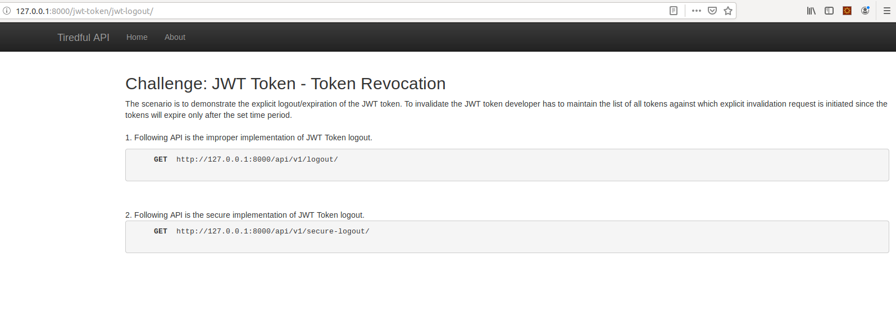</kbd>

According to challenge there are two logout API end points.

1. Insecure: &lt;host&gt;/api/v1/logout/
2. Secure: &lt;host&gt;/api/v1/secure-logout/

Since we have to confirm whether JWT token is being revoked or blacklisted, we will use Joker's account. You can use Joker's master plan API but for that you need Joker's RS256 signed token from &lt;host&gt;/api/v1/obtain-jwt-token-rs256/. The solution is demonstrated using HS256 signed JWT token - &lt;host&gt;/api/v1/obtain-jwt-token-hs256/ and plan API end point - &lt;host&gt;/api/v1/joker-plan/.

Obtain the HS256 signed token from &lt;host&gt;/api/v1/obtain-jwt-token-hs256/

<kbd></kbd>

Use obtained token and access the plan API end point &lt;host&gt;/api/v1/joker-plan/, you will get the plan details.

<kbd>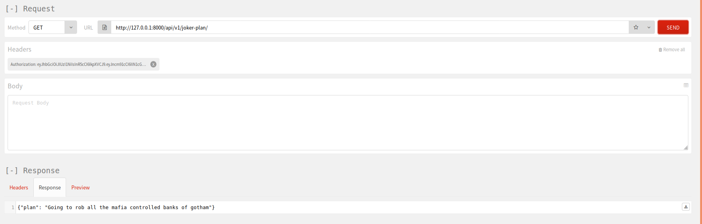</kbd>

Now initiate the logout request against the insecure logout API end point - &lt;host&gt;/api/v1/logout/ and include token in Authorization header.


<kbd>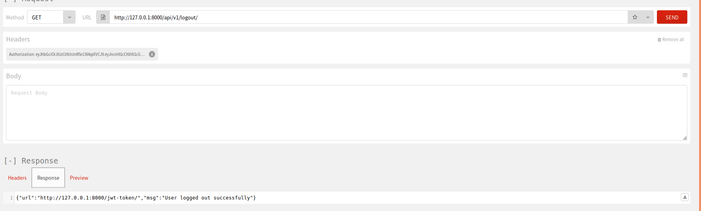</kbd>

Now again using the same token access the plan API end point - &lt;host&gt;/api/v1/joker-plan/ and even after the logout you are able to get the plan details which means the token is not blacklisted or revoked after explicit logout request.

<kbd>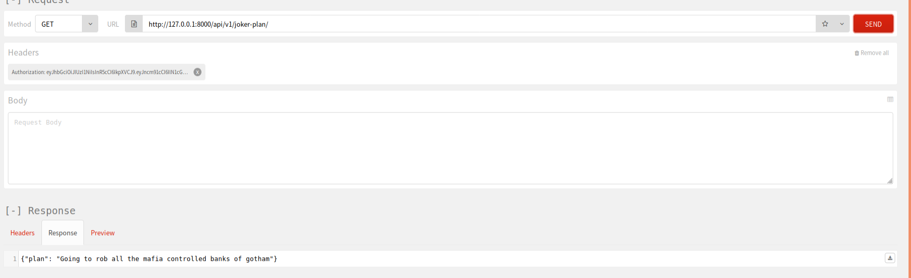</kbd>

For secure logout, initiate the logout request against the secure logout API end point &lt;host&gt;/api/v1/secure-logout/ and include token in Authorization header.

<kbd>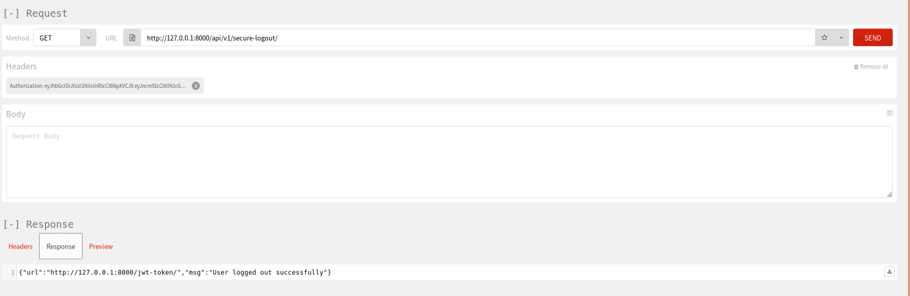</kbd>

Now using the same token access the plan API end point - &lt;host&gt;/api/v1/joker-plan/. This time you will get permission denied error, which means token has been blacklisted or revoked.


<kbd>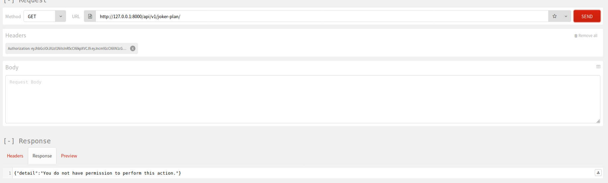</kbd>

## Crack JWT Secret

The aim of the challenge is to crack the secret used for signing JWT token signed using HS256 signing algorithm.

<kbd>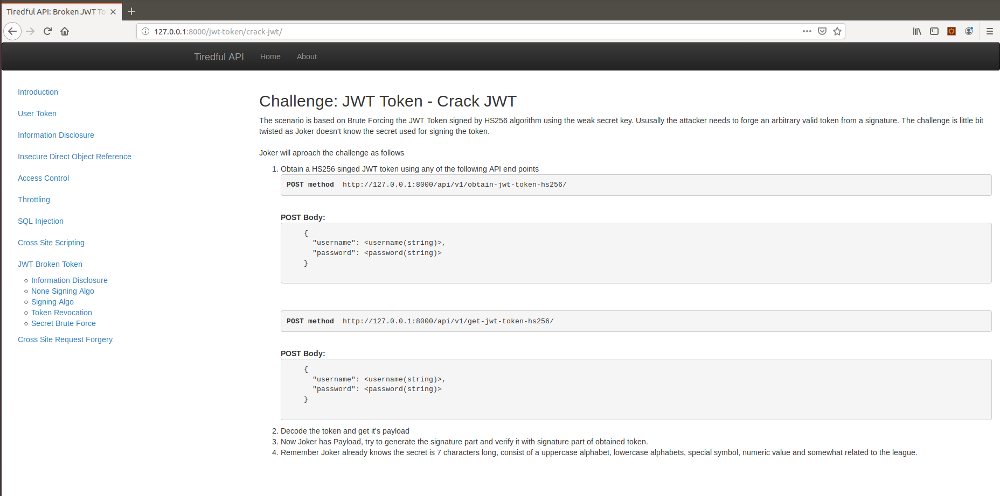</kbd>

According to the challenge, obtain a HS256 signed algorithm using following URLs.
1. &lt;host&gt;/api/v1/obtain-jwt-token-hs256/
2. &lt;host&gt;/api/v1/get-jwt-token-hs256/


You can complete this challenge either by your own script (as mentioned in the challenge description) or use some pre-built scripts from github like 
1. [https://github.com/lmammino/jwt-cracker](https://github.com/lmammino/jwt-cracker/)
2. [https://github.com/AresS31/jwtcat](https://github.com/AresS31/jwtcat)
3. [https://github.com/brendan-rius/c-jwt-cracker](https://github.com/brendan-rius/c-jwt-cracker)


These are all the intended solutions for the challenges, there are other ways also to exploit the vulnerabilities since the application is intentionally designed broken app.


